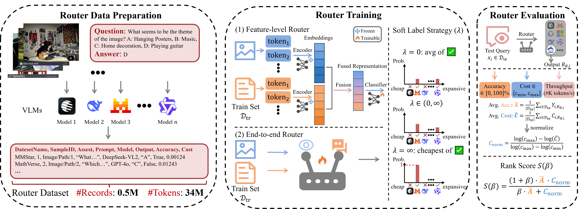
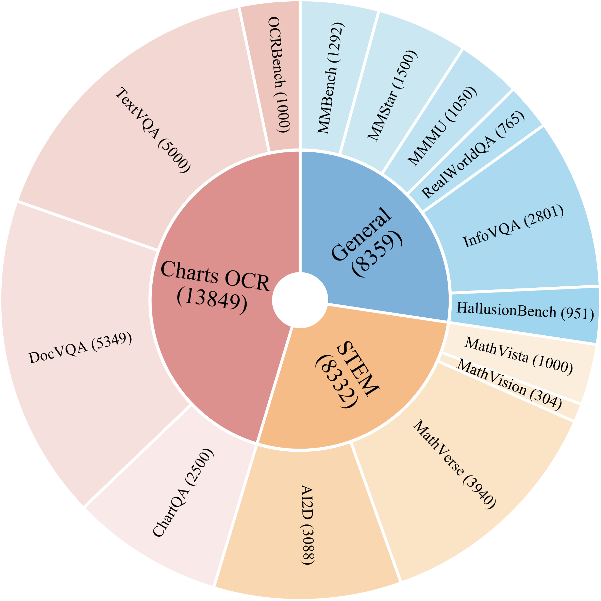
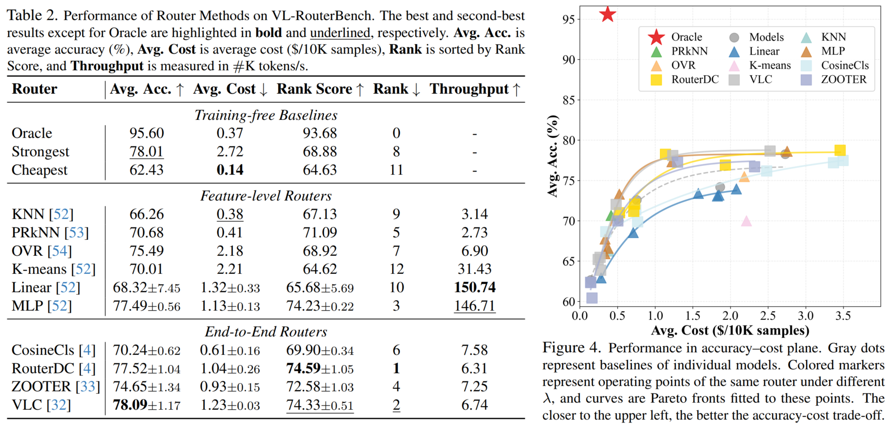

<div align="center">

<p align="center">
  
</p>

### VL-RouterBench: A Benchmark for Vision–Language Model Routing

[](https://arxiv.org/abs/2512.23562)
[](https://huggingface.co/datasets/KinghtH/VL-RouterBench)
[](LICENSE)
[](requirements.txt)

</div>

This repository provides a clean, reproducible implementation of **VL-RouterBench**, a benchmark and toolkit for **routing across a pool of Vision–Language Models (VLMs)** under both **performance** and **performance–cost** objectives.

<p align="center">
  
</p>

---

## 🌟 VL-RouterBench — a VLM routing benchmark

- VL-RouterBench as the **first unified benchmark tailored to multimodal VLM routing**.
- Datasets (14 total) grouped into 3 task families: **General, STEM, Charts OCR**.
- **15 open-source + 2 API models (GPT-4o and Gemini-Flash-2.5)**, spanning roughly **1B** to **78B** parameters, selected to reflect a realistic quality–cost–latency trade space.
- **30,540 samples**, **519,180** sample–model inference records, and **~34.5M** total tokens (input+output), constructed from VLM inference/scoring artifacts (VLMEvalKit logs).
- The derived **Accuracy–cost-aware soft labels** allocates probability mass only to correct models, smoothly interpolating from accuracy-only ($\lambda=0$) to “cheapest correct model” ($\lambda\rightarrow\infty$).
- Two Router architecture paradigms: 
  - **Feature-level routers**: frozen text+image encoders + lightweight classifier/fusion.
  - **End-to-end routers**: fine-tune multimodal backbones to directly predict the routed model.
- Primary metrics: **Average Accuracy**, **Average Cost**, **Rank Score**, and **Throughput (K tokens/s)**.

---

## 🚀 Installation

### Option A: Conda (recommended)

```bash
bash setup_env.sh
conda activate vl-routerbench
```

### Option B: pip only

```bash
pip install -r requirements.txt
```

---

## 📦 Data Preparation

VL-RouterBench converts [**VLMEvalKit**](https://github.com/open-compass/VLMEvalKit) outputs into a unified routing benchmark.

To make data setup easier, we provide a pre-packaged archive **`vlm_router_data.tar.gz`** that contains everything needed to run the pipeline. You can download it from any of the following channels and extract it under the repo root:

- **Google Drive**: [vlm_router_data.tar.gz](https://drive.google.com/file/d/1Boy5sAbTJmMeOttCZftu3DtbfXfFa_dE/view?usp=drive_link)
- **Baidu Netdisk**: [vlm_router_data.tar.gz](https://pan.baidu.com/s/1-rh_EKgFVPujVseB3MWyGA?pwd=8prk) (code: 8prk)
- **Hugging Face**: [vlm_router_data.tar.gz](https://huggingface.co/datasets/KinghtH/VL-RouterBench)

After downloading, extract it as:

```bash
tar -xzf vlm_router_data.tar.gz
```

By default, the pipeline expects the following directories (relative to repo root):

```bash
vlm_router_data/
  VLMEvalKit_evaluation/   # required (for is_correct / evaluation)
  VLMEvalKit_inference/    # required for accurate output-token counting (Step 2)
  TSV_images/              # optional (for TSV-packed image datasets)
```

Notes:
- **`VLMEvalKit_evaluation/`** is used by Step 1 & 4 (contains correctness signals).
- **`VLMEvalKit_inference/`** is used by Step 2 (extract real model outputs to count output tokens).
- **`TSV_images/`** is used by routers for training and inference to make routing decisions.

---

## 🎯 Quick Start

First, we need to convert the output data of VLMEvalKit into the Router Benchmark data.

### Run everything (recommended)

```bash
bash scripts/run_all.sh
```

### Run step-by-step

```bash
# Step 1: Build benchmark (BENCHMARKS/ ORACLE/ SPLITS/)
bash scripts/run_step1_build_benchmark.sh

# Step 2: Compute token statistics (reports/token_statistics/)
bash scripts/run_step2_calculate_tokens.sh

# Step 3: Build matrices (data/matrices/Y.npz, C.npy, cost_bounds.json; data/registry/meta.parquet)
bash scripts/run_step3_build_matrices.sh

# Step 4: Validate integrity (reports/data_integrity/)
bash scripts/run_step4_validate_data.sh

# Step 5: Extract features (EMBEDDINGS/)
bash scripts/run_step5_extract_features.sh

# Step 6: Evaluate baselines (reports/baselines_evaluation/)
bash scripts/run_step6_evaluate_baselines.sh
```

---

### 📁 Outputs (what you get)

After Steps 1–6, you will typically see:

```text
BENCHMARKS/                     # Step 1: per-sample JSONL with prompt + assets
ORACLE/score/                   # Step 1: parquet correctness table (sample_id, model_id, quality)
SPLITS/                         # Step 1: train/dev/test jsonl
reports/token_statistics/       # Step 2: token counts + token-based costs
data/matrices/                  # Step 3: Y.npz (quality), C.npy (cost), cost_bounds.json
data/registry/                  # Step 3: meta.parquet, model_index.pkl, ...
EMBEDDINGS/                     # Step 5: text/ and vision/ embeddings (parquet)
outputs/baselines_evaluation/   # Step 6: baseline summary + per-sample/per-dataset reports
```

---

## 🧠 Routers

### Training-free Baselines

- `Oracle` (upper bound)
- `StrongestGlobal` (single model with the highest average accuracy)
- `CheapestGlobal` (single model with the lowest average cost)
- `StrongestPerDataset` (highest accuracy per dataset)
- `RandomRouter` (random select)

Evaluate as in Step 6:
```
bash scripts/run_step6_evaluate_baselines.sh
```

### Feature-level routers

`KNN`, `PRkNN`, `OVR`, `K-means`, `Linear`, `MLP`

These routers use Step 5 embeddings (e.g., `bge-m3` + `dinov2-base`) and optional fusion in `routers/utils/fusion.py`.

Example: train & evaluate Linear router

```bash
python routers/linear/train_and_eval.py --dataset_dir . --output_dir outputs/linear_router
```

Evaluation sweeps are provided under `scripts/`:
- `scripts/train_knn_prknn_ovr_kmeans.sh`
- `scripts/train_linear_lambda_sweep.sh`
- `scripts/train_mlp_lambda_sweep.sh`

### End-to-end routers

`CosineCls`, `RouterDC`, `ZOOTER`, `VLC`

These routers train directly from `meta + BENCHMARKS` (text prompts and image assets), via the unified loader in `routers/utils/benchmarks_data.py`.

Example: train & evaluate VLC router

```bash
python routers/vlc/train_and_eval.py --dataset_dir . --model_type lxmert --output_dir outputs/vlc
```

Evaluation sweeps are provided under `scripts/`:
- `scripts/train_cosinecls_lambda_sweep.sh`
- `scripts/train_routerdc_lambda_sweep.sh`
- `scripts/train_zooter_lambda_sweep.sh`
- `scripts/train_vlc_lambda_sweep.sh`

---

## ⚙️ Configuration

- `config/datasets.yaml`: dataset pool and split ratios (train/dev/test)
- `config/models.yaml`: model pool (canonical IDs + aliases)
- `config/pricing.yaml`: token-based pricing (USD per 1M tokens) and budget points

---

## Datasets

Our benchmark curates **14 datasets** across three task groups—**General**, **STEM**, and **Charts & OCR/Document**—to induce sufficient routability differences while covering diverse real application scenarios. **General** includes *MMBench, MMStar, MMMU, RealWorldQA, InfoVQA,* and *HallusionBench*; **STEM** covers *MathVista, MathVision, MathVerse,* and *AI2D*; and **Charts & OCR/Document** contains *ChartQA, DocVQA, TextVQA,* and *OCRBench*, systematically examining chart reading and integrated OCR capability. The dataset distribution is shown below.

<p align="center">
  
</p>

---

## Models

Our benchmark includes **17 VLMs** (15 open-source + 2 API models), spanning roughly **1B–78B** parameters, to reflect a realistic quality–cost–latency trade space for routing. For MoE-style models, we use the notation **m-A-n** to denote *mB total parameters* with *nB activated* during inference. Token prices (USD per 1M tokens) are aligned with the estimates in `config/pricing.yaml` (referenced from `Together.ai` pricing by model size).

| Model | Params (B) | Input Price ($/1M tokens) | Output Price ($/1M tokens) |
|---|---:|---:|---:|
| Janus-Pro-1B | 1.0 | 0.05 | 0.05 |
| DeepSeek-VL2-Tiny | 27.0-A-1.0 | 0.05 | 0.05 |
| SmolVLM2 | 2.2 | 0.06 | 0.06 |
| Kimi-VL-A3B-Thinking-2506 | 16.0-A-2.8 | 0.20 | 0.25 |
| Phi-3.5-Vision | 4.2 | 0.10 | 0.10 |
| DeepSeek-VL2 | 27.0-A-4.5 | 0.35 | 0.50 |
| Janus-Pro-7B | 7.0 | 0.18 | 0.25 |
| MiMo-VL-7B-RL | 7.0 | 0.20 | 0.30 |
| LLaVA-Next-Vicuna-7B | 7.0 | 0.20 | 0.20 |
| Qianfan-VL-8B | 8.0 | 0.18 | 0.25 |
| Pixtral-12B | 12.0 | 0.25 | 0.35 |
| Gemma3-27B | 27.0 | 0.35 | 0.50 |
| Qwen2.5-VL-32B-Instruct | 32.0 | 0.40 | 0.60 |
| Qwen2.5-VL-72B-Instruct | 72.0 | 0.80 | 1.20 |
| InternVL2.5-78B | 78.0 | 1.00 | 1.50 |
| Gemini-Flash-2.5 | - | 0.30 | 2.40 |
| GPT-4o | - | 2.50 | 10.00 |

---

## 📏 Metrics

We adopt a multi-dimensional evaluation protocol centered on **accuracy**, **cost**, and **efficiency**. Let the router choose a model for each test sample \(x_i\).

- **Average Accuracy (Avg. Acc.)**: the mean correctness of routed decisions over the test set.
- **Average Cost (Avg. Cost)**: the mean inference cost of routed decisions over the test set.
- **Rank Score**: a multi-objective score that harmonically averages **Avg. Acc.** and **log-normalized cost**. Implementation: `routers/utils/rank_score.py`.
- **Throughput**: system efficiency measured as **tokens/s** (tokens per second).

---

## Main Results and Takeaway Messages

<p align="center">
  
</p>

### Takeaway Messages

- **(1) Large headroom for routing**: The large **Oracle vs. best single-model** gap indicates that routing can substantially improve cost-effectiveness over any fixed model choice.
- **(2) Strong routers, but still far from Oracle**: Most routers improve the **accuracy–cost trade-off** beyond the best single-model baseline; **RouterDC** ranks highest among the compared methods, yet all methods remain notably below Oracle—highlighting substantial room for improvement.
- **(3) Better representations help feature-level routing**: Higher-dimensional text/vision embeddings improve feature-level routers; the **BGE-M3 + SigLIP-L-16** pairing performs best, and simple multimodal fusion via **Normalize-Concat** yields the strongest overall **Rank Score**.
- **(4) End-to-end vs. feature-level**: End-to-end routers generally achieve better accuracy–cost trade-offs than feature-level routers, but may run at slightly lower throughput due to heavier multimodal backbones (e.g., **LXMERT** performing best among closely matched encoders).

---

## 🗂️ Project Structure

```text
VL_RouterBench/
  scripts/        # step runners + sweeps
  tools/          # benchmark construction + token stats + matrix building + validation
  routers/        # baselines + feature-level routers + end-to-end routers
  config/         # dataset/model/pricing configs
  tests/          # lightweight checks
  assets/         # icon + pipeline figure
```

---


## 📝 Citation

If you find VL-RouterBench useful, please cite:

```bibtex
@misc{huang2025vlrouterbenchbenchmarkvisionlanguagemodel,
      title={VL-RouterBench: A Benchmark for Vision-Language Model Routing}, 
      author={Zhehao Huang and Baijiong Lin and Jingyuan Zhang and Jingying Wang and Yuhang Liu and Ning Lu and Tao Li and Xiaolin Huang},
      year={2025},
      eprint={2512.23562},
      archivePrefix={arXiv},
      primaryClass={cs.LG},
      url={https://arxiv.org/abs/2512.23562}, 
}
```

---

## 🙏 Acknowledgements

- VLMEvalKit for providing the underlying VLM evaluation outputs.
- RouterArena for the Rank Score formulation inspiration.
- OpenRouterBench for github organization and repository template.


